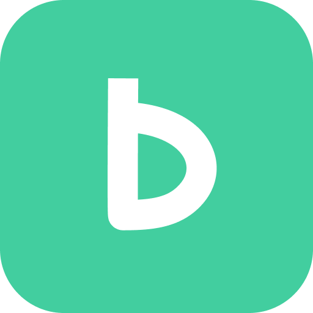
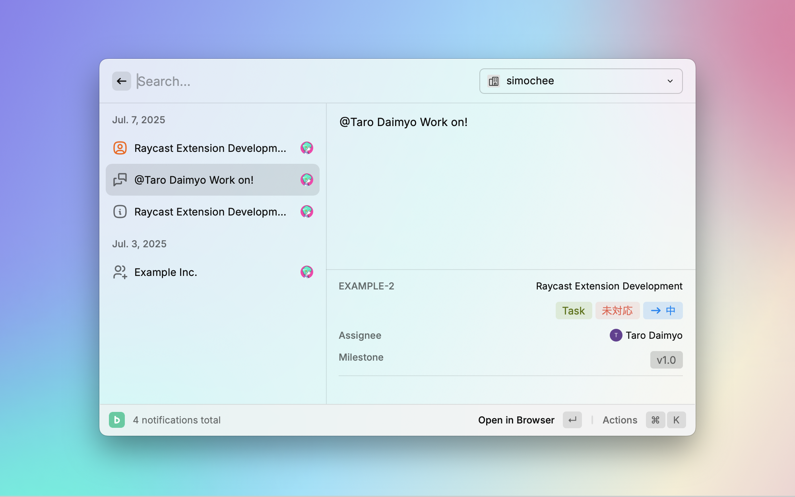

# Backlog

> [Backlog](https://backlog.com) を Raycast から直接操作。課題も、プロジェクトも、通知も。

## 主な機能

- メニューバーに未読の通知数を表示
- あなたへの通知を閲覧
- 最近見た課題、プロジェクト、Wiki を閲覧
- 複数スペースに対応

## インストール

1. **Raycast** を Mac で開く
1. **Store** へ移動し、「Backlog」を検索
1. **Install** をクリック

## 初期設定

初回利用時に、Backlog のスペースと API キーの登録が必要です。

1. Backlog のいずれかのコマンドを実行（ Notifications など）
1. スペースドメイン（ `.backlog.com` または `.backlog.jp` で終わるドメイン）と API キーを入力
1. **Save** をクリックするか、 Command + Enter キーの押下でスペースを登録

### API キーについて

以下の手順でスペースの API キーを取得できます。

1. グローバルバーにあるユーザーアイコンから **個人設定 → API** へ移動[^1]
1. **APIの設定** の **新しいAPIキーを発行** で `Backlog Raycast Extension` などでメモを入力し「登録」をクリック
1. **登録されたAPIキー** に表示された API キーをコピー

[^1]: スペース登録画面でスペースドメインを入力すると、 API ページへのリンクが表示されます

## ショートカット

- `Enter`: ブラウザで開く
- `Cmd + Shift + u`: URL をコピー
- `Cmd + f`: 詳細パネルを開閉
- `Cmd + Shift + r`: データの再取得

### 課題

- `Ctrl + c`: 課題キーのみをコピー
- `Ctrl + Shift + c`: 課題キーと件名をコピー

### 自分の課題

- `Cmd + Shift + f`: 絞り込みの変更

### プロジェクト

- `Cmd + Enter`: プロジェクトメニューを開く

### その他

- `Cmd + Shift + r`: 取得データのキャッシュを破棄 (コマンドを開き直してください)
- `Cmd + Shift + m`: 登録されたスペースの管理
- `Cmd + Shift + n`: 別のスペースを登録

## 開発

1. このリポジトリをクローンする
1. `pnpm install` （または `npx nypm install` ）で依存関係をインストール
1. `pnpm run dev` （または `npx nypm run dev` ）で拡張機能を Development Mode で起動
1. `Cmd + E` を押下し Raycast で拡張機能を開く
